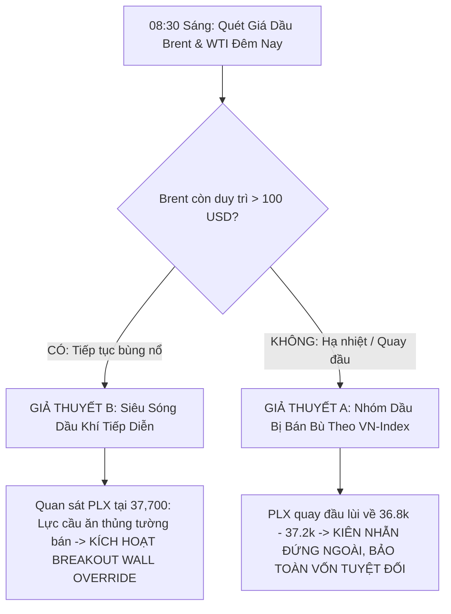

# CHIẾN LƯỢC TÁC CHIẾN NGÀY 2 (THỨ SÁU, 09/10/2026)
> **Hệ thống:** VNTrade Pro — Định Chế Giao Dịch Tự Động Định Lượng  
> **Chế độ:** LIVE_PAPER_MONEY (Vốn: 100,000,000 VNĐ tiền mặt sạch)  
> **Tình trạng:** Sẵn sàng trực canh phiên khớp lệnh thứ 2 sau cú rơi -14.42 điểm của VN-Index  

---

## 1. BỐI CẢNH VỊ THẾ BƯỚC VÀO PHIÊN NGÀY 2

1. **Di sản từ Ngày 1 (08/10/2026):**
   - VN-Index giảm sâu **-14.42 điểm (-0.82%)** lùi về 1,738.97 điểm do áp lực xả hàng T+2.5 cuối phiên.
   - Toàn bộ các nhóm ngành lớn (Ngân hàng, Bất động sản, Thép, Chứng khoán) đều bị bán tháo diện rộng.
   - Nhóm duy nhất đi ngược thị trường là **Dầu khí (PLX +4.14%, PVT +3.42%, BSR +1.10%)** nhờ giá dầu Brent vượt 103 USD/thùng.
   - **Tài khoản Bot:** Bảo toàn nguyên vẹn **100.000.000 VNĐ tiền mặt (0 đồng lỗ)** nhờ 16 tầng lọc phòng thủ kiên quyết từ chối giải ngân vào bão.

2. **Lợi thế cạnh tranh vượt trội của Bot:**
   - Trong khi phần lớn nhà đầu tư cá nhân bị kẹp hàng T+2.5 từ phiên hôm qua và chịu áp lực tâm lý nặng nề, hệ thống VNTrade Pro bước vào phiên thứ Sáu với **100% sức mua chủ động**.

---

## 2. TRỌNG TÂM CHIẾN THUẬT: PHÉP THỬ THỰC NGHIỆM NHÓM DẦU KHÍ

Dựa trên hồ sơ nhật ký `NHAT_KY_KINH_NGHIEM_NGAY_08_10_2026.md`, phiên sáng mai là thời khắc đối chiếu giữa 2 kịch bản:

### Kịch Bản 1: Giả Thuyết A (Bị Bán Bù Theo Thị Trường Chung)
* **Dấu hiệu:** PLX mở cửa ATO không giữ được sắc xanh, giá lùi về dưới 37.5k; PVT đỏ nhẹ; BSR giảm dưới 32.0k.
* **Hành động của Bot:** Giữ nguyên trạng thái đứng ngoài quan sát. Chứng minh quyết định bảo vệ tiền mặt hôm qua là sáng suốt, tránh được bẫy đu đỉnh T+2.5.

### Kịch Bản 2: Giả Thuyết B (Đà Tăng Tiếp Diễn - Momentum Runner)
* **Dấu hiệu:** PLX tiếp tục hút tiền mạnh, bước giá dư mua áp đảo.
* **Hành động của Bot:** Cơ chế mới **Breakout Wall Override** (đã cập nhật chiều 08/10) sẽ tự động cho phép khớp lệnh giải ngân khi giá thị trường vượt tường bán 37,700 đ kèm khối lượng bùng nổ, không bị chặn bởi rào cản OBI cũ.

---

## 3. VŨ KHÍ MỚI KÍCH HOẠT: BẮT ĐÁY HOẢNG LOẠN (OVERSOLD BOUNCE)

Sau phiên giảm hơn 14 điểm, phiên sáng Thứ Sáu thường chịu **quán tính bán tháo hoảng loạn đầu phiên (Panic Selling at ATO)**. 

Hệ thống đã trang bị dịch vụ mới [`OversoldBounceDetectorService.java`](file:///c:/stock/backend/src/main/java/com/vntrade/backend/service/OversoldBounceDetectorService.java):
* **Điều kiện kích hoạt dò đáy chiến thuật:**
  1. Cổ phiếu thuộc rổ Bluechips (FPT, HPG, VCB, SSI, MWG).
  2. Chỉ số RSI(14) chạm ngưỡng quá bán cực đại $\le 32.0$.
  3. Giá rơi thủng dải Bollinger Band dưới hoặc kiểm định thành công đường hỗ trợ cứng dài hạn SMA200.
  4. Xuất hiện nến rút chân tạo đáy (Hammer / Bullish Pinbar).
* **Quản trị rủi ro bắt đáy:**
  - **Tỷ trọng thử nghiệm:** Chỉ giải ngân tối đa **5% - 7.5% NAV** (khoảng 5 - 7.5 triệu VNĐ/mã).
  - **Cắt lỗ nghiêm ngặt (Tight Stop Loss):** Cố định **3.5% - 4.0%**.
  - **Mục tiêu chốt lời (Take Profit):** Nhịp hồi phục kỹ thuật (Mean Reversion) kiểm định lại EMA20 (+7% đến +10%).

---

## 4. LỊCH TRÌNH VẬN HÀNH 5 KHUNG GIỜ CHI TIẾT NGÀY 2

| Khung giờ | Giai đoạn thị trường | Nhiệm vụ trọng tâm của Robot |
| :--- | :--- | :--- |
| **08:30 - 08:55** | **Tiền trạm trước phiên** | Chạy Radar tiền trạm `GET /api/analysis/pre-market-sentiment`: Kiểm tra dầu Brent, Dow Jones, Nikkei và tâm lý mở cửa. |
| **09:00 - 09:15** | **Khớp lệnh mở cửa (ATO)** | **KHÔNG MUA ĐUỔI HOẢNG LOẠN**. Giám sát giá mở cửa của PLX, PVT, FPT, HPG để phát hiện bẫy ATO. |
| **09:15 - 11:30** | **Khớp lệnh liên tục Sáng** | 1. Quét tìm điểm bứt phá RRG Leader. 2. Rà soát Radar rình mồi `GET /api/bot/breakout-queue`. 3. Nếu có hoảng loạn, quét tín hiệu bắt đáy `GET /api/analysis/oversold-bounce`. |
| **11:30 - 12:55** | **Nghỉ trưa sàn HOSE** | **Smart Idle tự động kích hoạt**: Tiết kiệm 100% CPU máy tính, bot duy trì nhịp tim nhẹ. |
| **13:00 - 14:15** | **Áp lực hàng T+2.5 về** | Toàn thị trường đón nhận lượng hàng bắt đáy phiên thứ Tư. Cảnh giác bẫy xả chiều. |
| **14:15 - 14:45** | **15 phút vàng & ATC** | Khung giờ quyết định xu hướng phiên cuối tuần. Dời Trailing Stop và kiểm toán danh mục. |

---

## 5. MỤC TIÊU TÀI CHÍNH NGÀY 2
* **Mục tiêu lợi nhuận ngày (+1.5% NAV):** **+1.500.000 VNĐ**.
* **Cầu chì bảo vệ vốn ngày (-2.0% NAV):** Giới hạn lỗ tối đa **-2.000.000 VNĐ** (Ngắt mạch ngay nếu chạm).
* **Nguyên tắc tối thượng:** *"Thà bỏ lỡ cơ hội còn hơn để mất vốn. Khi thị trường còn rủi ro, 100% tiền mặt chính là vị thế mạnh nhất."*
