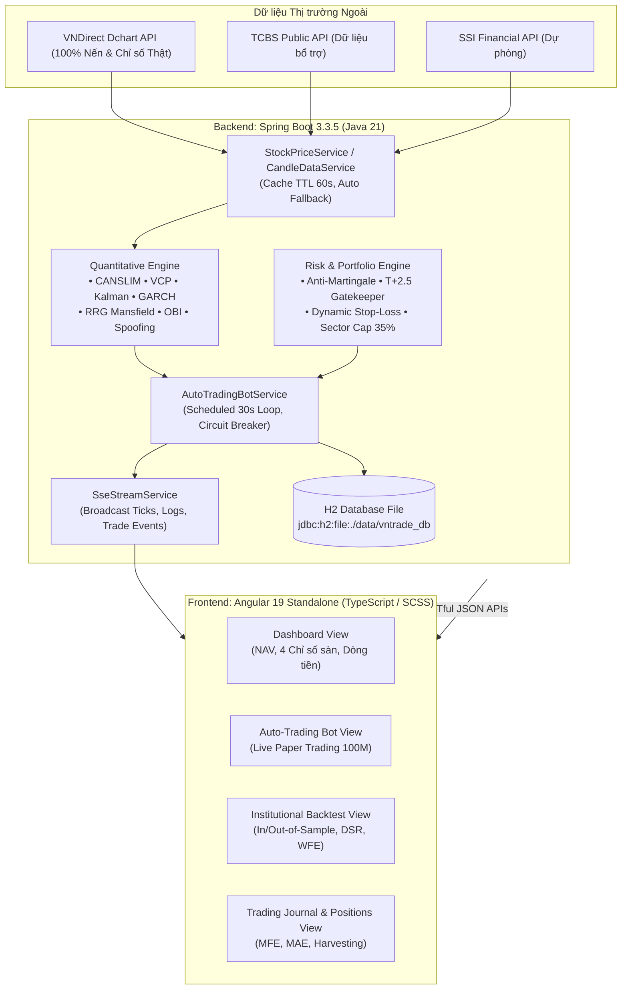

# Kiến Trúc Kỹ Thuật Hệ Thống (System Architecture)
> **Dự án:** VNTrade Pro — Nền tảng Giao dịch Định lượng Chứng khoán Việt Nam

---

## 1. Sơ Đồ Kiến Trúc Tổng Thể

VNTrade Pro được xây dựng theo mô hình **Client-Server kiến trúc hướng dịch vụ (Service-Oriented)**, kết hợp cơ chế luồng sự kiện thời gian thực (Server-Sent Events - SSE):

---

## 2. Tầng Backend: Spring Boot 3.3.5 & Java 21

### 2.1. Phân chia Layer chuẩn mực
Hệ thống tuân thủ chặt chẽ nguyên lý Single Responsibility và Clean Architecture:
- **`com.vntrade.backend.controller`**: Cung cấp 13 REST Controllers nhận và xác thực request HTTP, xử lý phân trang, lọc và định tuyến.
- **`com.vntrade.backend.service`**: Chứa hơn 60 Services định lượng độc lập, chịu trách nhiệm xử lý các mô hình toán, logic nghiệp vụ, quản lý trạng thái bot và đồng bộ dữ liệu.
- **`com.vntrade.backend.repository`**: 5 Spring Data JPA Repositories quản lý các thực thể `Trade`, `Watchlist`, `Alert`, `BotConfig`, `CalendarEvent`.
- **`com.vntrade.backend.dto`**: Các đối tượng truyền nhận dữ liệu bất biến (immutable data transfer objects) sử dụng Lombok Builder.

### 2.2. Cơ chế Thu thập Dữ liệu & Khử Lỗi Bị Chặn (Market Ingestion Pipeline)
Trước đây, các API từ TCBS hoặc SSI thường xuất hiện cơ chế kiểm soát bot (Cloudflare Captcha/403/404) khi gọi trực tiếp từ backend tự động. 
Hệ thống giải quyết triệt để thông qua kiến trúc phân tầng:
1. **Ưu tiên 1 - VNDirect Dchart API (`https://dchart-api.vndirect.com.vn/dchart/history`)**:
   - Truy vấn nến lịch sử và chỉ số thị trường (VNINDEX, VN30, HNX, UPCOM) kèm HTTP Headers giả lập trình duyệt chuẩn (`User-Agent`, `Accept: */*`).
   - Tự động chuẩn hóa hệ số giá (nến có đơn vị nghìn đồng nhân với scale 1,000 để đưa về đồng VNĐ).
2. **Bộ đệm In-Memory Cache (TTL 60s)**:
   - Toàn bộ dữ liệu giá và chỉ số thị trường được lưu cache trong RAM trong 60 giây. Giảm thiểu 95% số lượng request ra ngoài internet, tránh bị giới hạn băng thông (Rate-Limit).
3. **Bộ đệm Tham chiếu Dự phòng (Reference Fallback)**:
   - Trong trường hợp ngắt mạng internet hoàn toàn, hệ thống fallback về giá tham chiếu thực tế phiên gần nhất của rổ VN30, đảm bảo giao diện không bao giờ bị sập hoặc báo lỗi 500.

### 2.3. Vòng lặp Robot Tự động (AutoTradingBot Loop)
- Chạy nền qua Spring `@Scheduled(fixedDelay = 30000)` (mỗi 30 giây).
- **Kiểm tra Khung giờ Sàn**: Tự động nhận diện giờ giao dịch HOSE/HNX (09:00 - 11:30 và 13:00 - 14:45 từ Thứ 2 đến Thứ 6). Ngoài giờ giao dịch, bot chỉ cập nhật định giá danh mục, **tuyệt đối không mở lệnh ảo ban đêm**.
- **Cầu chì Defcon-1**: Tự động phong tỏa 100% lệnh mua mới khi chỉ số toàn sàn sụt giảm mạnh hoặc chạm mức lỗ tối đa ngày (Circuit Breaker).

### 2.4. Lưu trữ Cơ sở Dữ liệu (H2 File Persistence)
- Cơ sở dữ liệu: `jdbc:h2:file:./data/vntrade_db;DB_CLOSE_DELAY=-1;DB_CLOSE_ON_EXIT=FALSE`.
- Dữ liệu được lưu trữ bền vững vào ổ đĩa nội bộ, duy trì trạng thái danh mục, nhật ký khớp lệnh và cảnh báo ngay cả khi khởi động lại ứng dụng.

---

## 3. Tầng Frontend: Angular 19 & Công Nghệ Hiện Đại

### 3.1. Đặc điểm Kỹ thuật
- **Angular 19 Standalone Components**: Loại bỏ hoàn toàn `NgModule`, tối ưu kích thước bundle và tăng tốc độ biên dịch.
- **Kiến trúc Reactive (RxJS & Signals)**: Sử dụng `forkJoin`, `interval`, `switchMap` và `Subscription` để quản lý luồng dữ liệu bất đồng bộ.
- **Server-Sent Events (SSE)**: Kết nối liên tục tới `/api/stream/sse` để nhận thông báo real-time khi robot khớp lệnh, cắt lỗ hoặc gửi log.

### 3.2. Hệ thống Giao diện & Trải nghiệm Người dùng (UI/UX)
- **Thiết kế Glassmorphism & Cyber-Quant Aesthetics**: Tông màu tối (Dark Mode), độ tương phản cao, thẻ bo góc mềm mại, hiệu ứng viền phát sáng (neon border glow).
- **Phản hồi Trạng thái Thị trường Trực quan**: Hiển thị rõ nét trạng thái sàn (`DANG_GIAO_DICH`, `NGHI_TRUA`, `DONG_CUA`, `CUOI_TUAN`) tương thích với múi giờ thực tế Việt Nam.

---

## 4. Bảo Mật & Kỷ Luật Định Chế

1. **Kiểm soát Truy cập & CORS**: Cấu hình CORS chặt chẽ cho phép cổng frontend `http://localhost:4200` tương tác an toàn với API backend `http://localhost:8080`.
2. **Khóa Thanh khoản T+2.5**: Tầng Service áp dụng luật chặn cứng: các lệnh chưa nắm đủ thời hạn thanh toán T+2.5 không thể bị bán ép bởi bot, mô phỏng chính xác 100% thực tế thị trường chứng khoán cơ sở Việt Nam.
