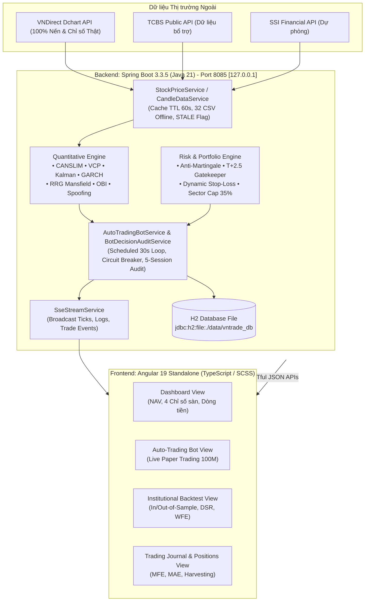

# Kiến Trúc Kỹ Thuật Hệ Thống (System Architecture)
> **Dự án:** VNTrade Pro — Nền tảng Giao dịch Định lượng Chứng khoán Việt Nam

---

## 1. Sơ Đồ Kiến Trúc Tổng Thể

VNTrade Pro được xây dựng theo mô hình **Client-Server kiến trúc hướng dịch vụ (Service-Oriented)**, kết hợp cơ chế luồng sự kiện thời gian thực (Server-Sent Events - SSE):

---

## 2. Tầng Backend: Spring Boot 3.3.5 & Java 21

### 2.1. Phân chia Layer chuẩn mực (Domain-Driven Modular Subpackages)
Hệ thống tuân thủ chặt chẽ nguyên lý Single Responsibility, Clean Architecture và Modular Domain Design.
Toàn bộ hơn 67 dịch vụ chuyên sâu được tổ chức gọn gàng thành **8 sub-packages** chuyên biệt:

1. **`com.vntrade.backend.service.calculation`** *(Tầng Tính Toán & Định Lượng Chuyên Sâu)*:
   - Chịu trách nhiệm thực hiện các mô hình toán, chỉ báo kỹ thuật, ma trận xoay tua và phân tích thống kê:
   - `TechnicalIndicatorService`, `RelativeRotationGraphService`, `KalmanFilterTrendService`, `GarchVolatilityForecastService`, `MarkowitzOptimizationService`, `BlackLittermanAllocationService`, `MonteCarloProjectionService`, `MonteCarloBacktestStressService`, `MultiFactorAttributionService`, `BrinsonPerformanceAttributionService`, `LiquidityAdjustedReturnService`, `StatisticalArbitrageService`, `DeflatedSharpeAuditService`, `ImplementationShortfallAuditService`, `PortfolioVarRiskService`, `IntradayOrderFlowFootprintService`, `AdvancedTradingAnalyticsService`.

2. **`com.vntrade.backend.service.decision`** *(Tầng Ra Quyết Định Mua/Bán & Sàng Lọc Tín Hiệu)*:
   - Chịu trách nhiệm phân tích dữ liệu đầu vào và đưa ra kết luận dứt khoát: **MUA, BÁN hay ĐỨNG NGOÀI**:
   - `StrategyService`, `QuantitativeStrategyEngine`, `VN30SignalScreenerService`, `CanslimRatingService`, `VcpPatternDetectorService`, `OversoldBounceDetectorService`, `OrderBookImbalanceService`, `SectorRotationService`, `SmartMoneyFlowService`, `PreMarketSentimentService`, `MarketRegimeDetectionService`, `RegimeSwitchingSignalService`, `MultiTimeframeConfluenceService`, `MicrostructureSpoofingDetectorService`, `StrategyOptimizerService`.

3. **`com.vntrade.backend.service.execution`** *(Tầng Điều Phối Khớp Lệnh & Vận Hành Bot Cơ Sở)*:
   - Quản lý vòng đời lệnh mua bán, phân bổ quy mô vốn (Position Sizing), tài khoản và audit quyết định:
   - `AutoTradingBotService`, `BotDecisionAuditService`, `TradeService`, `BotConfigService`, `DailyIncomeService`, `MarketSimulationService`, `AdaptivePositionSizingService`, `KellyCriterionService`, `TargetVolatilityScalingService`, `AtcExecutionService`, `OrderExecutionAlgorithmService`, `IntradayVwapTwapExecutionService`, `AlmgrenChrissExecutionService`.

4. **`com.vntrade.backend.service.risk`** *(Tầng Quản Trị Rủi Ro & Phòng Hộ Kỷ Luật)*:
   - Cầu chì an toàn, phòng vệ sập sàn, kiểm soát trần ngành 35% NAV và kiểm toán kỷ luật già làng:
   - `RiskService`, `MarketCrashProtectionService`, `VietnamVeteranRulesService`, `BlackSwanStressScenarioService`, `ForeignFlowRiskService`, `RealMoneyAuditService`, `RiskStressTestService`.

5. **`com.vntrade.backend.service.futures`** *(Tầng Giao Dịch & Chiến Lược Phái Sinh VN30F T+0)*:
   - Động cơ phái sinh kiếm tiền 2 chiều Long/Short, bám độ lệch Basis, Trailing Stop tự động:
   - `VN30FuturesTradingService`, `VN30FuturesStrategyEngine`, `VN30FuturesCandleService`, `VN30FuturesBacktestService`.

6. **`com.vntrade.backend.service.marketdata`** *(Tầng Dữ Liệu Thị Trường & Streaming)*:
   - Kết nối dữ liệu nến thật, báo giá cấp 2, bảng giá thời gian thực và SSE stream:
   - `CandleDataService`, `StockPriceService`, `OrderBookService`, `SseStreamService`.

7. **`com.vntrade.backend.service.backtest`** *(Tầng Kiểm Thử Định Chế & Tối Ưu Hóa)*:
   - `BacktestService`, `InstitutionalBacktestService`, `WalkForwardOptimizationService`.

8. **`com.vntrade.backend.service.portfolio`** *(Tầng Danh Mục, Nhật Ký & Lịch Trình)*:
   - `PortfolioHistoryService`, `JournalService`, `WatchlistService`, `AlertService`, `MarketSchedulerService`.

### 2.2. Cơ chế Thu thập Dữ liệu & An Toàn Báo Giá (Market Ingestion Pipeline)
Hệ thống áp dụng kiến trúc 4 tầng thu thập và bảo vệ dữ liệu giá thật:
1. **Ưu tiên 1 - VNDirect Dchart API (`https://dchart-api.vndirect.com.vn/dchart/history`)**:
   - Truy vấn nến lịch sử và chỉ số thị trường (VNINDEX, VN30, HNX, UPCOM) kèm HTTP Headers giả lập trình duyệt chuẩn (`User-Agent`, `Accept: */*`). Tự động quy đổi tỷ lệ giá về đơn vị đồng (VNĐ).
2. **Ưu tiên 2 - TCBS Public API**:
   - Nạp dữ liệu bars nến ngày bổ trợ khi VNDirect gặp sự cố gián đoạn.
3. **Ưu tiên 3 - Kho Nến Thật Cục Bộ 32 File CSV (2020 - 2026)**:
   - Nạp trực tiếp từ `backend/data/historical_data/{symbol}.csv` chứa 1.688 phiên nến thật đã được tải về và lưu trữ ngoại tuyến. Đảm bảo chạy backtest và phân tích độc lập 100% không phụ thuộc internet sống.
4. **Cơ Chế Cúp Cầu Chì Khi Mất Dữ Liệu Thật (STALE Flag)**:
   - **Tuyệt đối không dùng giá giả**: Khi toàn bộ API sàn ngắt kết nối và không có cache hợp lệ, giá lập tức trả về `null`, gán cờ `dataSource = "STALE"`. Robot dừng 100% lệnh mở mới và giao diện Frontend phát tín hiệu cảnh báo màu đỏ chói.

### 2.3. Vòng lặp Robot Tự động & Ghi Vết Quyết Định (AutoTradingBot Loop & Audit)
- Chạy nền qua Spring `@Scheduled(fixedDelay = 30000)` (mỗi 30 giây).
- **Kiểm tra Kết Nối Dữ Liệu (Bước 0)**: Ngay đầu mỗi chu kỳ, bot kiểm tra `isMarketDataConnected()`. Nếu dữ liệu STALE, dừng toàn bộ việc quét và mở vị thế mới.
- **Kiểm tra Khung giờ Sàn**: Tự động nhận diện giờ giao dịch HOSE/HNX (09:00 - 11:30 và 13:00 - 14:45 từ Thứ 2 đến Thứ 6). Ngoài giờ giao dịch, bot chỉ cập nhật định giá danh mục, **tuyệt đối không mở lệnh ảo ban đêm**.
- **Cầu chì Defcon-1**: Tự động phong tỏa 100% lệnh mua mới khi chỉ số toàn sàn sụt giảm mạnh hoặc chạm mức lỗ tối đa ngày (Circuit Breaker).
- **Ghi Vết Quyết Định (Bot Decision Audit)**: Toàn bộ quyết định (kể cả khi bị tầng lọc loại) đều được ghi vào bảng `bot_decision_audit`. Hệ thống tự động đối soát giá nến 5 phiên sau để đo lường xem việc từ chối đó là đúng đắn (giữ an toàn vốn) hay bỏ lỡ cơ hội.

### 2.4. Lưu trữ Cơ sở Dữ liệu (H2 File Persistence)
- Cơ sở dữ liệu: `jdbc:h2:file:./data/vntrade_db;DB_CLOSE_DELAY=-1;DB_CLOSE_ON_EXIT=FALSE`.
- Dữ liệu được lưu trữ bền vững vào ổ đĩa nội bộ, duy trì trạng thái danh mục, nhật ký khớp lệnh và cảnh báo ngay cả khi khởi động lại ứng dụng.

---

## 3. Tầng Frontend: Angular 19 & Công Nghệ Hiện Đại

### 3.1. Đặc điểm Kỹ thuật
- **Angular 19 Standalone Components**: Loại bỏ hoàn toàn `NgModule`, tối ưu kích thước bundle và tăng tốc độ biên dịch.
- **Kiến trúc Reactive (RxJS & Signals)**: Sử dụng `forkJoin`, `interval`, `switchMap` và `Subscription` để quản lý luồng dữ liệu bất đồng bộ.
- **Server-Sent Events (SSE)**: Kết nối liên tục tới `/api/stream/sse` để nhận thông báo real-time khi robot khớp lệnh, cắt lỗ hoặc gửi log.

### 3.2. Hệ thống Giao diện & Trải nghiệm Người dùng (UI/UX)
- **Thiết kế Glassmorphism & Cyber-Quant Aesthetics**: Tông màu tối (Dark Mode), độ tương phản cao, thẻ bo góc mềm mại, hiệu ứng viền phát sáng (neon border glow).
- **Phản hồi Trạng thái Thị trường Trực quan**: Hiển thị rõ nét trạng thái sàn (`DANG_GIAO_DICH`, `NGHI_TRUA`, `DONG_CUA`, `CUOI_TUAN`) tương thích với múi giờ thực tế Việt Nam.

---

## 4. Bảo Mật & Kỷ Luật Định Chế

1. **Khóa Cổng Localhost (server.address: 127.0.0.1)**: Backend lắng nghe độc quyền trên `127.0.0.1:8085`, khóa chặn 100% truy cập trái phép từ bên ngoài mạng internet vào máy chủ cục bộ.
2. **Kiểm soát Truy cập & CORS**: Cấu hình CORS chặt chẽ cho phép cổng frontend `http://localhost:4200` tương tác an toàn với API backend `http://127.0.0.1:8085`.
3. **Khóa Thanh khoản T+2.5 VSDC**: Tầng Service áp dụng luật chặn cứng: các lệnh chưa nắm đủ thời hạn thanh toán T+2.5 không thể bị bán ép bởi bot, mô phỏng chính xác 100% thực tế thị trường chứng khoán cơ sở Việt Nam.
