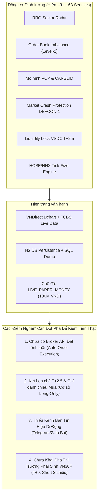
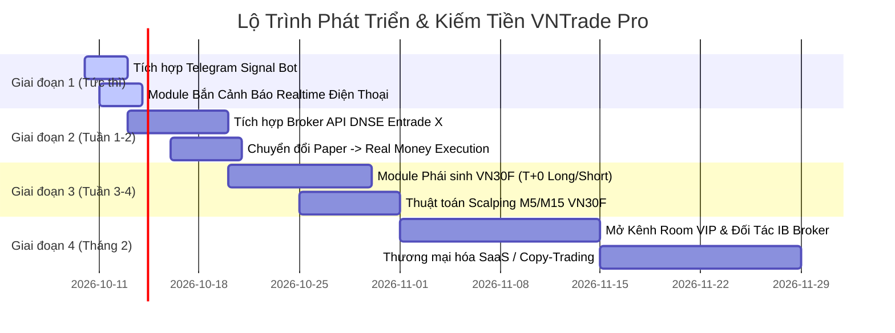

# BÁO CÁO TOÀN DIỆN: ĐÁNH GIÁ HIỆN TRẠNG & CHIẾN LƯỢC KIẾM TIỀN THẬT SỰ CÙNG VNTRADE PRO
> **Dự án:** VNTrade Pro — Hệ Thống Giao Dịch Định Lượng & Quản Lý Danh Mục Chứng Khoán Việt Nam  
> **Mục tiêu tối thượng:** Chuyển hóa nền tảng công nghệ thành **dòng tiền thật sự (Real Cash Flow & Alpha)** bền vững.  
> **Thời điểm lập chiến lược:** Tháng 10/2026.

---

## PHẦN 1: ĐÁNH GIÁ HIỆN TRẠNG TOÀN DIỆN HỆ THỐNG (CURRENT SYSTEM AUDIT)

### 1. Những thế mạnh vượt trội đã được kiểm chứng
1. **Khả năng quản trị rủi ro & kỷ luật sắt đá**: 
   - Trong phiên rơi tự do **-14.42 điểm (-0.82%)**, hệ thống bảo vệ toàn vẹn **100% tiền mặt (100.000.000 đ)**, kích hoạt cầu chì phòng hộ DEFCON-1 và lọc sạch các bẫy xả hàng (PLX, DGW, FRT).
2. **Kho vũ khí toán học định chế (Institutional Stack)**:
   - 63 dịch vụ chuyên sâu: RRG (Relative Rotation Graph), CANSLIM, VCP, GARCH(1,1), Monte Carlo 90 ngày, Footprint Order Flow, HMM Regime Switching.
3. **Tuân thủ 100% luật chơi TTCK Việt Nam**:
   - Khóa thanh khoản T+2.5 chuẩn VSDC (đếm ngày làm việc, chỉ mở bán từ 13:00 ngày T+2).
   - Chuẩn hóa bước giá (10đ, 50đ, 100đ) chống lỗi Order Rejected.
   - Hạch toán phí mua/bán (0.15%), thuế TNCN (0.10%), phân bổ phí mua theo tỷ lệ.

### 2. Các điểm nghẽn ngăn cản việc tạo dòng tiền ngay lúc này
- **Điểm nghẽn 1 (Execution):** Lệnh vẫn chỉ lưu vào H2 DB local (`LIVE_PAPER_MONEY`). Để kiếm tiền thật, bot cần kết nối API sàn chứng khoán để tự động bung tiền mua cổ phiếu thật.
- **Điểm nghẽn 2 (Cơ chế thị trường cơ sở):** Thị trường cơ sở bị trói buộc T+2.5 và không thể Bán khống (Short). Khi thị trường sập hoặc đi ngang, bot chỉ có thể đứng ngoài phòng thủ, không tạo ra lợi nhuận trong chiều giảm.
- **Điểm nghẽn 3 (Phân phối tín hiệu):** Tín hiệu chỉ hiển thị trên Web `localhost:4200`. Nhà đầu tư không thể ôm máy tính cả ngày, rất cần Telegram Bot đẩy cảnh báo trực tiếp về điện thoại sau vài mili-giây.

---

## PHẦN 2: 4 MÔ HÌNH KIẾM TIỀN THẬT SỰ TỪ VNTRADE PRO (MONETIZATION BLUEPRINTS)

---

### 🚀 MÔ HÌNH 1: TỰ DOANH THUẬT TOÁN (PROPRIETARY TRADING)
*Tự đầu tư tiền của mình, dùng bot làm việc 100% tự động thay con người.*

#### 1. Đột phá sang Thị trường Phái Sinh VN30F (Hợp đồng tương lai T+0)
- **Tại sao Phái sinh là vũ khí kiếm tiền số 1 cho Bot tại VN?**
  - **Giao dịch T+0**: Mua bán chốt lời trong vài phút/vài giây, hoàn toàn triệt tiêu rủi ro kẹt 2.5 ngày.
  - **Kiếm tiền 2 chiều (Long & Short)**: Khi thị trường sập như phiên vừa qua (-14.42 điểm), Bot mở lệnh **SHORT** $\rightarrow$ Ăn trọn biên độ 10 - 15 điểm phái sinh (Lãi **1.000.000 - 1.500.000 đ / hợp đồng** chỉ trong một nhịp xả).
  - **Đòn bẩy ký quỹ 1:5 đến 1:7**: Với số vốn 50 - 100 triệu, có thể giao dịch 2 - 4 hợp đồng VN30F.
  - **Thanh khoản cực lớn**: 25,000 - 45,000 tỷ/ngày, khớp lệnh tức thì không lo kẹt hàng.
- **Chiến lược bot phái sinh:**
  - *M5/M15 Trend Following:* Kết hợp Kalman Filter và HMM Regime Switching.
  - *Oversold Scalping:* Bắt nhịp hồi kỹ thuật khi Basis chênh lệch quá lớn hoặc RSI chạm ngưỡng cực đại.

#### 2. Swing Trading Cơ sở VN30 tự động qua DNSE OpenAPI
- **Cổng kết nối:** Tích hợp với **DNSE OpenAPI (Entrade X)** — Công ty chứng khoán duy nhất tại Việt Nam mở API chính thức miễn phí cho nhà đầu tư cá nhân lập trình tự động hóa.
- Tự động đặt lệnh mua/bán cổ phiếu thật khi đạt 16 tầng lọc khắt khe.

---

### 💎 MÔ HÌNH 2: BÁN TÍN HIỆU VIP (SUBSCRIPTION / SAAS MODEL)
*Mô hình tạo dòng tiền thụ động đều đặn hàng tháng mà KHÔNG CHỊU RỦI RO THỊ TRƯỜNG.*

- **Nhu cầu thực tế:** Hơn 8 triệu tài khoản chứng khoán cá nhân tại Việt Nam, đa số là F0 thiếu kỷ luật, hay đu đỉnh và thua lỗ. Họ cực kỳ khao khát một công cụ định lượng khách quan giúp họ:
  - Biết mã nào thuộc nhóm **Dẫn dắt (RRG Leading)** để mua, mã nào **Tụt hậu (Lagging)** để né.
  - Nhận cảnh báo bão **DEFCON Crash Protection** trước khi thị trường sập cuối phiên.
  - Nhận điểm mua **Bứt phá (Breakout)** và điểm bắt đáy **Oversold Bounce** có tỷ lệ R:R rõ ràng.

#### Thiết kế sản phẩm Subscription:
| Gói Dịch Vụ | Tính Năng Cung Cấp | Mức Phí Dự Kiến |
| :--- | :--- | :--- |
| **Gói VIP Cơ Sở (Telegram Bot)** | Tự động bắn tín hiệu Mua/Bán VN30, Cảnh báo bão DEFCON, RRG Radar hàng ngày. | **499.000 đ – 990.000 đ / tháng** |
| **Gói VIP Phái Sinh (Realtime)** | Bắn tín hiệu Long/Short VN30F khung M5/M15, điểm Cutloss & Target cụ thể theo từng nhịp thị trường. | **1.490.000 đ – 1.990.000 đ / tháng** |
| **Gói Web Pro (Dashboard Access)** | Cấp tài khoản truy cập Web Dashboard phân tích Footprint, Backtest, VCP, RRG Radar. | **2.490.000 đ / quý** |

> 💰 **Bài toán dòng tiền:**  
> Chỉ cần xây dựng cộng đồng VIP với **50 - 100 khách hàng**:  
> `100 khách * 800.000 đ = 80.000.000 đ / tháng (Dòng tiền ròng thụ động 100%)`.

---

### 🤝 MÔ HÌNH 3: MÔI GIỚI CÔNG NGHỆ (INTRODUCING BROKER - IB AFFILIATE)
*Mô hình "Công Cụ Miễn Phí — Thu Phí Giao Dịch" (Scale vô hạn).*

- **Cơ chế hoạt động:**
  1. Bạn đăng ký làm Đối tác Môi giới / Đại lý (IB) cho VPS (thị phần số 1 VN), TCBS, hoặc DNSE.
  2. Bạn cung cấp **VNTrade Pro Bot & Room Tín Hiệu HOÀN TOÀN MIỄN PHÍ** cho bất kỳ nhà đầu tư nào mở tài khoản chứng khoán và gắn mã giới thiệu (ID) của bạn.
  3. Khi khách hàng giao dịch mua bán theo bot, công ty chứng khoán sẽ tự động chia sẻ lại **50% đến 65% phí giao dịch** vào tài khoản của bạn hàng tháng!
- **Sức mạnh đòn bẩy tài chính:**
  - Một khách hàng vốn 200M lướt sóng 4 vòng/tháng tạo ra khoảng 1.500.000 đ phí giao dịch $\rightarrow$ Bạn nhận ~800.000 đ hoa hồng.
  - Với **100 khách hàng hoạt động** $\rightarrow$ **Thu nhập hoa hồng 80.000.000 đ / tháng**, không phụ thuộc vào việc bạn thắng hay thua lệnh cá nhân!

---

### 📊 MÔ HÌNH 4: SOCIAL COPY-TRADING & QUẢN LÝ TÀI SẢN ỦY THÁC
- Kết nối cổng **TCBS iCopy** hoặc **DNSE Social Trading**:
  - Bạn nạp 100M - 200M vào tài khoản Master của bạn, cho Bot chạy chuẩn chỉ theo kỷ luật 16 tầng lọc.
  - Hiển thị công khai trang lịch sử giao dịch và tỷ suất sinh lời (Track-record) đã được kiểm chứng.
  - Các nhà đầu tư khác bấm nút "Sao chép lệnh" (Copy Trade).
  - Bạn nhận **15% - 20% phí hiệu quả (Performance Fee)** trên tổng số tiền lãi mà bot tạo ra cho các tài khoản sao chép (áp dụng cơ chế đỉnh cao nhất High-Water Mark).

---

## PHẦN 3: LỘ TRÌNH TRIỂN KHAI THỰC CHIẾN (STEP-BY-STEP ROADMAP)

### Bước 1 (Ưu tiên cao nhất - Làm ngay): Tích hợp Telegram Alert Bot
- Tạo bot Telegram miễn phí qua `@BotFather`.
- Xây dựng service `TelegramNotificationService.java` trong Spring Boot.
- Khi bot phát hiện điểm mua Breakout, Oversold Bounce hoặc Cảnh báo bão DEFCON $\rightarrow$ Bắn tin nhắn trực tiếp về Telegram cá nhân/nhóm VIP.
- **Giá trị tức thì:** Bạn có thể đi làm, đi cà phê nhưng vẫn nhận trọn vẹn mọi cơ hội từ thị trường theo thời gian thực.

### Bước 2: Tích hợp Đặt Lệnh Thật (DNSE OpenAPI Bridge)
- Mở tài khoản DNSE Entrade X (miễn phí), lấy App ID và Secret Key.
- Xây dựng `DnseBrokerExecutionService.java` để chuyển đổi lệnh từ trạng thái giả lập sang đặt lệnh thật trên bảng giá HOSE/HNX.

### Bước 3: Mở rộng Động cơ Phái Sinh VN30F (T+0 Long/Short)
- Xây dựng module nhận dữ liệu tick-data VN30F1M và thuật toán khớp lệnh 2 chiều để tối đa hóa lợi nhuận khi thị trường giảm điểm.

---

## PHẦN 4: KẾT LUẬN & ĐỀ XUẤT HÀNH ĐỘNG
Hệ thống **VNTrade Pro** hiện tại đã sở hữu nền móng công nghệ và thuật toán định lượng thuộc nhóm top đầu thị trường bán lẻ tại Việt Nam.

Để biến nó thành **"cỗ máy in tiền thật sự"**, bước đi thông minh và nhanh nhất lúc này là:
1. **Lắp ngay Module Telegram Notification**: Biến hệ thống thành trợ lý cá nhân bắn tín hiệu trực tiếp vào điện thoại.
2. **Kích hoạt kết nối Broker API**: Chuyển từ Paper Trading sang tài khoản thật.
3. **Mở rộng Phái sinh VN30F**: Để có thể kiếm tiền cả khi thị trường lao dốc.
