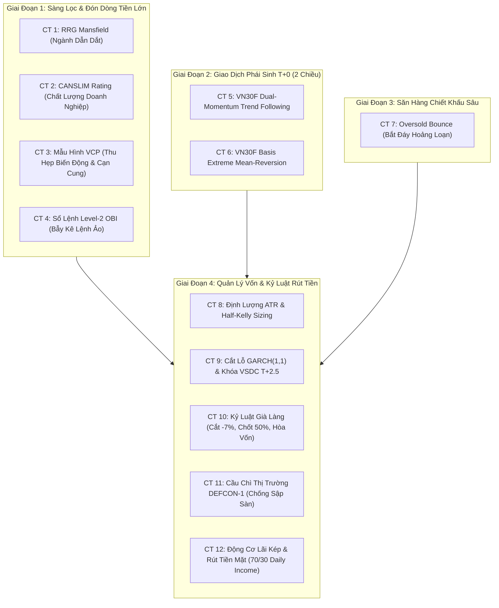

# WHITEPAPER: TỔNG QUAN TOÀN BỘ DỰ ÁN & CẨM NANG CÔNG THỨC TRADE KIẾM TIỀN
> **Dự án:** VNTrade Pro — Nền Tảng Giao Dịch Định Lượng & Quản Lý Danh Mục Chứng Khoán Việt Nam  
> **Mục tiêu:** Bản tổng kết toàn diện kiến trúc, vị trí các tài liệu và toàn bộ công thức toán học sinh lời để rà soát (review) dự án từ A đến Z.

---

## PHẦN 1: BẢN ĐỒ TÀI LIỆU DỰ ÁN (DOCUMENTATION MAP)

Dưới đây là bảng chỉ dẫn toàn bộ 10 tài liệu kỹ thuật và cẩm nang vận hành được lưu trữ trong thư mục [`docs/`](file:///c:/Users/Windows/Desktop/chungkhoan/docs):

| STT | Tài Liệu | Đường Dẫn File | Mục Đích & Nội Dung Chính |
| :---: | :--- | :--- | :--- |
| 1 | **Master Review & Công Thức** | [`TONG_QUAN_DU_AN_VA_CONG_THUC_KIEM_TIEN.md`](file:///c:/Users/Windows/Desktop/chungkhoan/docs/TONG_QUAN_DU_AN_VA_CONG_THUC_KIEM_TIEN.md) | **(File Hiện Tại)** Tổng quan toàn dự án, vị trí tài liệu và tập hợp 12 công thức trade kiếm tiền thực tế. |
| 2 | **Kiến Trúc Kỹ Thuật** | [`ARCHITECTURE.md`](file:///c:/Users/Windows/Desktop/chungkhoan/docs/ARCHITECTURE.md) | Kiến trúc tổng thể Client-Server, phân chia 8 sub-packages chuẩn hóa, pipeline dữ liệu VNDirect Dchart, cơ chế SSE và H2 Persistence. |
| 3 | **Toán Học & Thuật Toán** | [`QUANT_ALGORITHMS.md`](file:///c:/Users/Windows/Desktop/chungkhoan/docs/QUANT_ALGORITHMS.md) | Cơ sở toán học chuyên sâu: Bộ lọc Kalman, GARCH(1,1), Half-Kelly, Trượt giá Square-Root Law, Deflated Sharpe Ratio (DSR), Monte Carlo. |
| 4 | **Chiến Lược Kiếm Tiền Thật** | [`CHIEN_LUOC_MONETIZATION_VA_HIEN_TRANG.md`](file:///c:/Users/Windows/Desktop/chungkhoan/docs/CHIEN_LUOC_MONETIZATION_VA_HIEN_TRANG.md) | Đánh giá hiện trạng và 4 mô hình thương mại hóa: Tự doanh thuật toán, Bán tín hiệu VIP Telegram, Môi giới IB Affiliate, Copy-Trading. |
| 5 | **Hướng Dẫn Tính Năng UI** | [`FEATURES_GUIDE.md`](file:///c:/Users/Windows/Desktop/chungkhoan/docs/FEATURES_GUIDE.md) | Hướng dẫn chi tiết từng màn hình Dashboard, Watchlist, Portfolio, Journal, Analysis, Risk, Bot Trader và Phái Sinh T+0. |
| 6 | **Đặc Tả REST API** | [`API_REFERENCE.md`](file:///c:/Users/Windows/Desktop/chungkhoan/docs/API_REFERENCE.md) | Danh mục đầy đủ các REST API endpoints của Backend (Bot, Trades, Analysis, Risk, Futures, Income, Streams...). |
| 7 | **SOP Vận Hành Thực Chiến** | [`LIVE_TRADING_RUNBOOK.md`](file:///c:/Users/Windows/Desktop/chungkhoan/docs/LIVE_TRADING_RUNBOOK.md) | Quy trình vận hành chuẩn từng khung giờ sàn HOSE/HNX (08:30 tiền trạm -> 09:00 ATO -> 11:30 nghỉ trưa -> 13:00 T+2.5 -> 14:45 ATC). |
| 8 | **Báo Cáo Đánh Giá Ngày 1** | [`BOT_ASSESSMENT_REPORT.md`](file:///c:/Users/Windows/Desktop/chungkhoan/docs/BOT_ASSESSMENT_REPORT.md) | Báo cáo kiểm chứng năng lực bảo toàn 100M vốn trong phiên thị trường sập -14.42 điểm, kích hoạt DEFCON-1. |
| 9 | **Kế Hoạch Tác Chiến Ngày 2** | [`CHIEN_LUOC_NGAY_2_09_10_2026.md`](file:///c:/Users/Windows/Desktop/chungkhoan/docs/CHIEN_LUOC_NGAY_2_09_10_2026.md) | Kế hoạch đối chiếu nhóm Dầu khí (PLX, PVT), kích hoạt vũ khí bắt đáy hoảng loạn Oversold Bounce. |
| 10 | **Nhật Ký Kinh Nghiệm** | [`NHAT_KY_KINH_NGHIEM_NGAY_08_10_2026.md`](file:///c:/Users/Windows/Desktop/chungkhoan/docs/NHAT_KY_KINH_NGHIEM_NGAY_08_10_2026.md) | Nhật ký thực địa, phân tích tâm lý xả hàng T+2.5 của Big Boys và bài học thực tiễn. |

---

## PHẦN 2: TỔNG QUAN KIẾN TRÚC & TỔ CHỨC CODE CHUẨN

Hệ thống được thiết kế theo tiêu chuẩn công nghệ định chế tài chính:

```
chungkhoan/
├── backend/                                   # Spring Boot 3.3.5 (Java 21)
│   ├── src/main/java/com/vntrade/backend/
│   │   ├── service/                           # 67 Services chia thành 8 sub-packages chuẩn:
│   │   │   ├── calculation/                   # [1] Tầng tính toán định lượng & chỉ báo
│   │   │   ├── decision/                      # [2] Tầng quyết định mua/bán & sàng lọc
│   │   │   ├── execution/                     # [3] Tầng khớp lệnh & điều phối bot cơ sở
│   │   │   ├── risk/                          # [4] Tầng quản trị rủi ro & cầu chì DEFCON-1
│   │   │   ├── futures/                       # [5] Tầng phái sinh VN30F1M T+0 Long/Short
│   │   │   ├── marketdata/                    # [6] Tầng nạp dữ liệu thật & streaming SSE
│   │   │   ├── backtest/                      # [7] Tầng kiểm thử định chế & Walk-Forward
│   │   │   └── portfolio/                     # [8] Tầng danh mục, nhật ký & lịch trình
│   │   ├── controller/                        # 14 REST Controllers
│   │   ├── dto/                               # 72 Data Transfer Objects
│   │   ├── entity/                            # JPA Entities (Trade, Watchlist, Alert...)
│   │   └── repository/                        # JPA Repositories
│   └── src/test/java/                         # 56 Test classes (129/129 tests PASS 100%)
├── frontend/                                  # Angular 22 (Standalone Components / SCSS)
│   └── src/app/components/                    # Dashboard, Bot, Futures, Portfolio, Risk...
├── docs/                                      # 10 Tài liệu chuyên sâu toàn dự án
└── README.md                                  # Hướng dẫn khởi động nhanh (Quickstart)
```

---

## PHẦN 3: CẨM NANG 12 CÔNG THỨC TRADE KIẾM TIỀN THỰC CHIẾN

Hệ thống VNTrade Pro không sử dụng "chỉ báo cảm tính" của F0 mà áp dụng các **công thức định lượng có lợi thế xác suất toán học (Mathematical Edge / Alpha)**:



---

### 📈 CÔNG THỨC 1: RADAR SỨC MẠNH TƯƠNG ĐỐI RRG MANSFIELD (DÒNG TIỀN DẪN DẮT)
- **Mã nguồn:** [`RelativeRotationGraphService.java`](file:///c:/Users/Windows/Desktop/chungkhoan/backend/src/main/java/com/vntrade/backend/service/calculation/RelativeRotationGraphService.java)
- **Mục tiêu:** Chỉ giải ngân vào cổ phiếu thuộc nhóm ngành đang hút tiền mạnh nhất thị trường, triệt tiêu nguy cơ mua nhầm cổ phiếu "tụt hậu" (chôn vốn).
- **Công thức toán học:**
  $$\text{RS}_t = \frac{\text{Price}_{\text{Stock}, t}}{\text{Price}_{\text{VN-Index}, t}} \times 100$$
  $$\text{RS-Ratio}_t = 100 + \frac{\text{RS}_t - \text{SMA}_{10}(\text{RS})}{\text{StDev}_{10}(\text{RS})} \times 10$$
  $$\text{RS-Momentum}_t = 100 + \frac{\text{RS-Ratio}_t - \text{SMA}_5(\text{RS-Ratio})}{\text{StDev}_5(\text{RS-Ratio})} \times 10$$
  $$\text{Heading Angle } \theta = \text{atan2}(\Delta \text{Momentum}, \Delta \text{Ratio}) \times \frac{180}{\pi}$$
- **Quy tắc giải ngân:**
  - ✅ **LEADING & Hướng Đông Bắc ($\theta \in [0^\circ, 90^\circ]$)**: Cổ phiếu tăng tốc vượt trội thị trường $\to$ **ƯU TIÊN MUA TỐI ĐA (OVERWEIGHT)**.
  - ⛔ **LAGGING & Hướng Tây Nam ($\theta \in [180^\circ, 270^\circ]$)**: Dòng tiền đang tháo chạy $\to$ **CẤM MUA TUYỆT ĐỐI (TRÁNH BẪY BULL TRAP)**.

---

### 🏆 CÔNG THỨC 2: CHẤM ĐIỂM ĐỊNH CHẾ CANSLIM (7 BỘ LỌC TĂNG TRƯỞNG)
- **Mã nguồn:** [`CanslimRatingService.java`](file:///c:/Users/Windows/Desktop/chungkhoan/backend/src/main/java/com/vntrade/backend/service/decision/CanslimRatingService.java)
- **Mục tiêu:** Lọc ra 5% doanh nghiệp tăng trưởng xuất sắc nhất sàn HOSE/HNX.
- **Công thức trọng số 100 điểm:**
  $$\text{CANSLIM Score} = 0.20 \times C + 0.15 \times A + 0.15 \times N + 0.15 \times S + 0.15 \times L + 0.10 \times I + 0.10 \times M$$
  - **C (Current EPS)**: Tăng trưởng LNST quý $> 20\%$ so với cùng kỳ.
  - **A (Annual EPS)**: ROE $> 17\%$ và EPS 3 năm tăng trưởng liên tục.
  - **N (New Catalyst)**: Tiệm cận đỉnh 52 tuần hoặc mở rộng quy mô.
  - **S (Supply/Demand)**: Khối lượng phiên bứt phá $\ge 1.5\times$ MA(20).
  - **L (Leader)**: Chỉ số sức mạnh giá RS $> 70$.
  - **I (Institutional)**: Khối ngoại hoặc tự doanh gom ròng $\ge 3$ phiên liên tiếp.
  - **M (Market)**: VN-Index nằm trên MA(50) ngày.
- **Quy tắc giải ngân:** Chỉ giải ngân khi **Điểm số $\ge 75$ điểm** (Xếp hạng Grade A / A+).

---

### 🌀 CÔNG THỨC 3: MẪU HÌNH THU HẸP ĐỘ BIẾN ĐỘNG VCP (VOLATILITY CONTRACTION PATTERN)
- **Mã nguồn:** [`VcpPatternDetectorService.java`](file:///c:/Users/Windows/Desktop/chungkhoan/backend/src/main/java/com/vntrade/backend/service/decision/VcpPatternDetectorService.java)
- **Mục tiêu:** Phát hiện pha gom hàng cạn cung của tổ chức (Mark Minervini) trước khi bùng nổ giá.
- **Công thức xác định độ co thắt:**
  $$\Delta T_k = \frac{\text{High}_k - \text{Low}_k}{\text{High}_k} \times 100\%$$
  - Điều kiện hình thành VCP:
    $$\Delta T_1 \ (15\% - 25\%) \longrightarrow \Delta T_2 \ (8\% - 12\%) \longrightarrow \Delta T_3 \ (3\% - 6\%)$$
  - **Khối lượng cạn kiệt (Volume Dry-Up)**:
    $$\text{Volume}_{T_3} \le 0.60 \times \text{MA}_{20}(\text{Volume})$$
- **Điểm mua Pivot Breakout:**
  $$\text{Price} \ge \text{Pivot Peak}_{T_3} \quad \text{và} \quad \text{Volume} \ge 1.80 \times \text{MA}_{20}(\text{Volume})$$

---

### 🔍 CÔNG THỨC 4: VI CẤU TRÚC SỔ LỆNH OBI LEVEL-2 (BẪY KÊ LỆNH ẢO)
- **Mã nguồn:** [`OrderBookImbalanceService.java`](file:///c:/Users/Windows/Desktop/chungkhoan/backend/src/main/java/com/vntrade/backend/service/decision/OrderBookImbalanceService.java), [`MicrostructureSpoofingDetectorService.java`](file:///c:/Users/Windows/Desktop/chungkhoan/backend/src/main/java/com/vntrade/backend/service/decision/MicrostructureSpoofingDetectorService.java)
- **Mục tiêu:** Soi thấu ý đồ chặn lệnh của Big Boys trên 3 bước giá tốt nhất sàn HOSE.
- **Hệ số Mất cân bằng Sổ lệnh (OBI):**
  $$\text{OBI} = \frac{\sum_{i=1}^3 \text{BidVol}_i - \sum_{i=1}^3 \text{AskVol}_i}{\sum_{i=1}^3 \text{BidVol}_i + \sum_{i=1}^3 \text{AskVol}_i} \in [-1.0, +1.0]$$
- **Nhận diện Tường Bán (Ask Liquidity Wall):**
  $$\text{Wall Ratio} = \frac{\text{AskVol}_1}{\sum_{i=1}^3 \text{AskVol}_i} \ge 0.45 \quad (\text{Khối lượng } \ge 300.000 \text{ cp})$$
- **Cơ chế Breakout Wall Override:**
  - Khi xuất hiện tường bán đè giá lớn: Bot tạm dừng mua đuổi.
  - Khi lực cầu tổ chức nuốt sạch tường bán ($\text{CurrentPrice} \ge \text{WallPrice}$): Bot bung lệnh giải ngân theo dòng tiền lớn!

---

### ⚡ CÔNG THỨC 5: PHÁI SINH VN30F DUAL-MOMENTUM (T+0 KIẾM TIỀN 2 CHIỀU)
- **Mã nguồn:** [`VN30FuturesStrategyEngine.java`](file:///c:/Users/Windows/Desktop/chungkhoan/backend/src/main/java/com/vntrade/backend/service/futures/VN30FuturesStrategyEngine.java), [`VN30FuturesTradingService.java`](file:///c:/Users/Windows/Desktop/chungkhoan/backend/src/main/java/com/vntrade/backend/service/futures/VN30FuturesTradingService.java)
- **Mục tiêu:** Khớp lệnh T+0, ăn chênh lệch điểm số ngay trong ngày cả khi thị trường tăng và giảm.
- **Tín hiệu MỞ LONG (Kỳ vọng chỉ số tăng):**
  $$\text{EMA}_9 > \text{EMA}_{21} \quad \wedge \quad \text{Price} > \text{VWAP}_{5\text{m}} \quad \wedge \quad \text{RSI}(14) \in [48, 68] \quad \wedge \quad \text{MACD Hist} > 0$$
- **Tín hiệu MỞ SHORT (Kiếm lời khi thị trường sụp đổ):**
  $$\text{EMA}_9 < \text{EMA}_{21} \quad \wedge \quad \text{Price} < \text{VWAP}_{5\text{m}} \quad \wedge \quad \text{RSI}(14) \in [32, 52] \quad \wedge \quad \text{MACD Hist} < 0$$
- **Hạch toán dòng tiền mặt:**
  $$\text{Gross PnL (VNĐ)} = (\text{ExitPrice} - \text{EntryPrice}) \times 100.000 \text{ đ} \times \text{Contracts} \quad (\text{Đối với Long})$$
  $$\text{Gross PnL (VNĐ)} = (\text{EntryPrice} - \text{ExitPrice}) \times 100.000 \text{ đ} \times \text{Contracts} \quad (\text{Đối với Short})$$
  $$\text{Net PnL (VNĐ)} = \text{Gross PnL} - (9.400 \text{ đ} \times \text{Contracts})$$

---

### ⚖️ CÔNG THỨC 6: PHÁI SINH VN30F ĐỘ LỆCH BASIS CỰC ĐẠI (BASIS MEAN-REVERSION)
- **Mã nguồn:** [`VN30FuturesStrategyEngine.java`](file:///c:/Users/Windows/Desktop/chungkhoan/backend/src/main/java/com/vntrade/backend/service/futures/VN30FuturesStrategyEngine.java)
- **Mục tiêu:** Bắt nhịp hồi tụ khi tâm lý thị trường hưng phấn hoặc hoảng loạn quá đà.
- **Công thức độ lệch Basis:**
  $$\text{Basis} = \text{Price}_{\text{VN30F1M}} - \text{Price}_{\text{VN30 Index}}$$
  - **Kịch bản Chiết khấu Sâu ($\text{Basis} \le -7.0 \text{ điểm} \wedge \text{RSI} < 35$):** Thị trường phái sinh đang quá sợ hãi $\to$ **MỞ LỆNH LONG BẮT NHỊP HỘI TỤ**.
  - **Kịch bản Hưng phấn Quá Mức ($\text{Basis} \ge +7.5 \text{ điểm} \wedge \text{RSI} > 70$):** HĐTL bị đẩy giá ảo $\to$ **MỞ LỆNH SHORT ÉP HỒI QUY**.

---

### 🩸 CÔNG THỨC 7: BẮT ĐÁY HOẢNG LOẠN (OVERSOLD BOUNCE)
- **Mã nguồn:** [`OversoldBounceDetectorService.java`](file:///c:/Users/Windows/Desktop/chungkhoan/backend/src/main/java/com/vntrade/backend/service/decision/OversoldBounceDetectorService.java)
- **Mục tiêu:** Mua cổ phiếu cơ sở Bluechips ở vùng định giá rẻ mạt khi thị trường bán tháo ATO.
- **Điều kiện kích hoạt:**
  1. Cổ phiếu thuộc rổ Bluechips VN30 (VCB, FPT, HPG, MWG, SSI).
  2. $\text{RSI}(14) \le 32.0$ (Ngưỡng quá bán cực đại).
  3. Giá rơi thủng dải dưới Bollinger Band: $\text{Low} \le \text{SMA}_{20} - 2.0 \times \sigma$.
  4. Xuất hiện nến rút chân tạo đáy (Bullish Pinbar / Hammer):
     $$\text{Lower Shadow} \ge 2.0 \times \text{Body Length} \quad \wedge \quad \text{Close} \ge \frac{\text{High} + \text{Low}}{2}$$
- **Quản trị rủi ro:** Chỉ giải ngân tỷ trọng thăm dò **5% - 7.5% NAV**, Cắt lỗ hẹp cố định **-3.5%**, Chốt lời nhịp hồi phục **+7% đến +10%**.

---

### 📊 CÔNG THỨC 8: ĐỊNH LƯỢNG QUY MÔ VỊ THẾ ATR & HALF-KELLY
- **Mã nguồn:** [`AdaptivePositionSizingService.java`](file:///c:/Users/Windows/Desktop/chungkhoan/backend/src/main/java/com/vntrade/backend/service/execution/AdaptivePositionSizingService.java), [`KellyCriterionService.java`](file:///c:/Users/Windows/Desktop/chungkhoan/backend/src/main/java/com/vntrade/backend/service/execution/KellyCriterionService.java)
- **Mục tiêu:** Tuyệt đối không "tất tay" (All-in), phân bổ vốn dựa trên độ biến động và tỷ lệ thắng.
- **Số cổ phiếu mua theo ATR:**
  $$\text{Shares} = \text{roundDown100}\left( \frac{\text{Capital} \times \text{RiskPercent}}{2.0 \times \text{ATR}(14)} \right)$$
- **Tỷ trọng tối ưu Half-Kelly (Bảo thủ):**
  $$f^* = \frac{1}{2} \left( p - \frac{1 - p}{b} \right)$$
  *(với $p$ là Win Rate, $b$ là tỷ số Lời/Lỗ bình quân Payoff Ratio).*
- **Khống chế trần tỷ trọng ngành:**
  $$\sum \text{Cost}_{\text{Sector}} \le 35\% \times \text{NAV}$$

---

### ⏳ CÔNG THỨC 9: BẢO VỆ THANH KHOẢN T+2.5 CHUẨN VSDC
- **Mã nguồn:** [`AutoTradingBotService.java`](file:///c:/Users/Windows/Desktop/chungkhoan/backend/src/main/java/com/vntrade/backend/service/execution/AutoTradingBotService.java)
- **Mục tiêu:** Tuân thủ 100% chu kỳ thanh toán bù trừ của Trung tâm Lưu ký VSDC.
- **Thuật toán kiểm tra điều kiện bán:**
  $$\text{CanSell} = (\text{BusinessDaysBetween}(\text{TradeDate}, \text{CurrentDate}) \ge 2) \quad \wedge \quad (\text{CurrentTime} \ge 13:00:00)$$
  - Chặn đứng 100% lệnh bán trong ngày T+0, T+1 và phiên sáng T+2.
  - Tự động bỏ qua Thứ Bảy, Chủ Nhật và ngày lễ.

---

### 🛡️ CÔNG THỨC 10: 7 TIÊU CHUẨN KỶ LUẬT GIÀ LÀNG TTCK VIỆT NAM
- **Mã nguồn:** [`VietnamVeteranRulesService.java`](file:///c:/Users/Windows/Desktop/chungkhoan/backend/src/main/java/com/vntrade/backend/service/risk/VietnamVeteranRulesService.java), [`TradeService.java`](file:///c:/Users/Windows/Desktop/chungkhoan/backend/src/main/java/com/vntrade/backend/service/execution/TradeService.java)
- **Mục tiêu:** Bảo toàn vốn tối thượng và thu hoạch tiền mặt đều đặn.
1. **Cắt lỗ cây sàn đầu tiên**: Khống chế mức lỗ tối đa **-7.0%** (biên độ trần sàn HOSE).
2. **Tỷ số Lợi Nhuận / Rủi Ro (Payoff Ratio)**: $\text{Target} / \text{Cutloss} \ge 2.0x$.
3. **Bảo trợ thanh khoản VSA**: Khối lượng breakout $\ge 1.5\times$ MA20.
4. **Gặt hái tiền mặt 50% khi lãi $\ge 10.0\%$**:
   - Bán chốt lời 50% số lượng cổ phiếu bỏ túi tiền mặt.
   - Dời điểm chặn lỗ của 50% cổ phiếu còn lại lên **Hòa vốn không rủi ro (Risk-Free Breakeven)**:
     $$\text{New Stop Loss} = \text{roundTick}\big(\text{EntryPrice} \times (1 + 0.005)\big) \quad (\text{Bao gồm cả phí mua, phí bán và thuế})$$
5. **Tuyệt đối không trung bình giá xuống**: Không bao giờ mua thêm cổ phiếu đang lỗ.
6. **Không mua đuổi trần tím**: Tránh bẫy hưng phấn T+2.5.

---

### 🚨 CÔNG THỨC 11: CẦU CHÌ PHÒNG HỘ SỤP ĐỔ DEFCON-1 (CRASH PROTECTION)
- **Mã nguồn:** [`MarketCrashProtectionService.java`](file:///c:/Users/Windows/Desktop/chungkhoan/backend/src/main/java/com/vntrade/backend/service/risk/MarketCrashProtectionService.java)
- **Mục tiêu:** Ngăn chặn hiện tượng bán giải chấp chéo (Call Margin Chéo).
- **Điều kiện ngắt mạch toàn diện:**
  $$\text{DEFCON-1 Triggered} = (\Delta \text{VN-Index} \le -20.0 \text{ điểm}) \quad \vee \quad \left( \sum_{k=1}^7 \mathbb{I}(\% \Delta \text{Pillar}_k \le -6.8\%) \ge 2 \right)$$
  *(Theo dõi 7 trụ cột: VCB, FPT, HPG, TCB, SSI, MWG, VHM).*
- **Hành động tức thì:** Khóa 100% lệnh mua mới, chuyển danh mục về trạng thái phòng thủ tối đa.

---

### 💰 CÔNG THỨC 12: ĐỘNG CƠ LÃI KÉP & RÚT TIỀN TIÊU DÙNG (70/30 DAILY INCOME)
- **Mã nguồn:** [`DailyIncomeService.java`](file:///c:/Users/Windows/Desktop/chungkhoan/backend/src/main/java/com/vntrade/backend/service/execution/DailyIncomeService.java)
- **Mục tiêu:** Vừa tăng trưởng quy mô NAV dài hạn (Lãi kép), vừa tạo ra tiền mặt chi tiêu thực tế hàng ngày.
- **Phân bổ lợi nhuận đã chốt trong ngày ($\text{Realized Profit} > 0$):**
  $$\text{Vốn Tái Đầu Tư (70%)} = \text{RealizedProfit} \times 0.70$$
  $$\text{Tiền Mặt Rút Tiêu Dùng (30%)} = \text{RealizedProfit} \times 0.30$$
- **Ví dụ thực tế:** Khi hệ thống chốt lời 2.100.000 VNĐ trong ngày:
  - **1.470.000 VNĐ** (70%) được giữ lại gối đầu nâng quy mô tài khoản cho các phiên sau.
  - **630.000 VNĐ** (30%) sẵn sàng rút về tài khoản ngân hàng chi tiêu sinh hoạt.

---

## PHẦN 4: HƯỚNG DẪN 3 BƯỚC REVIEW TOÀN BỘ HỆ THỐNG

1. **Khởi chạy Backend & Frontend:**
   - Backend (Port 8085): `cd backend && mvn clean spring-boot:run`
   - Frontend (Port 4200): `cd frontend && npx ng serve`
2. **Kiểm tra trạng thái trên trình duyệt:**
   - Tổng quan danh mục: [http://localhost:4200/dashboard](http://localhost:4200/dashboard)
   - Robot giao dịch cơ sở: [http://localhost:4200/bot](http://localhost:4200/bot)
   - Terminal Phái sinh T+0: [http://localhost:4200/futures](http://localhost:4200/futures)
3. **Chạy bộ kiểm thử tự động (129 Tests PASS 100%):**
   ```bash
   cd backend
   mvn test
   ```
